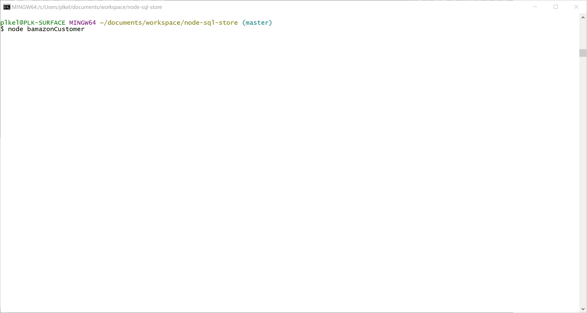
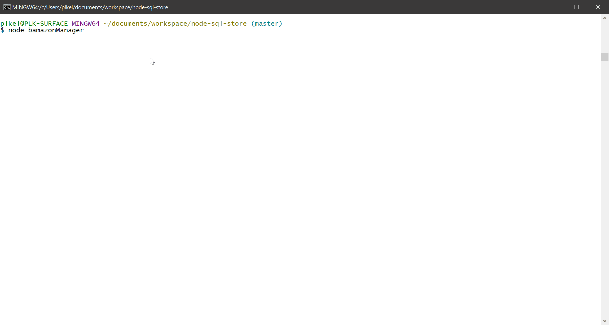
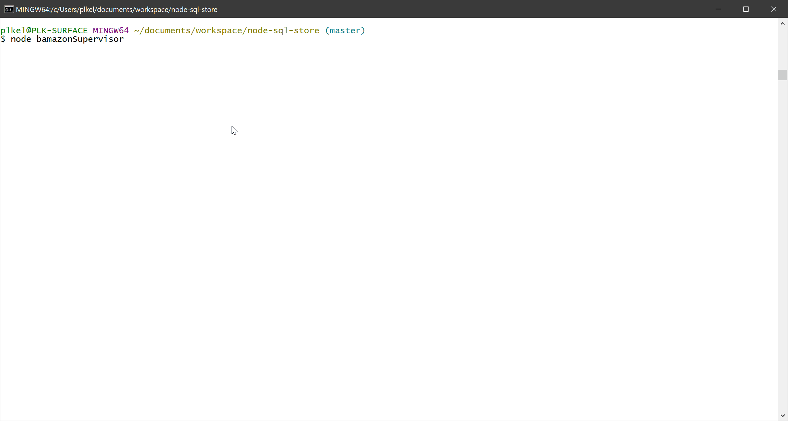

# Amazon-Style Store

## Overview
This is an Amazon-like storefront and application using Node and MySQL. It takes in orders from customers and depletes stock from the store's inventory and includes a component that allows a manager to manage inventory. Finally, it has a component that allows Supervisors to track product sales across the store's departments and provide a summary of the highest-grossing store departments.

### Features
1. bamazonCustomer.js
  * On launch, displays available products for sale
  * Allows customers to purchase available products
  * Allows customers to display available products for sale
2. bamazonManager.js
  * Allows managers to display available products for sale
  * Allows managers to add products
  * Allows managers to find products with low inventory (fewer than 5 in stock)
  * Allows managers to add to a product's inventory
3. bamazonSupervisor.js
  * Allows supervisors to view Product Sales by Department
  * Allows supervisors to view Department list
  * Allows supervisors to add new Departments
  * Allows managers to display available products for sale

### Using MyStore
Use the following commands to launch the Customer, Manager, and Supervisor components of the MyStore application:
* node bamazonCustomer
* node bamazonManager
* node bamazonSupervisor

### MyStore Results
MyStore is a command line application; accordingly, it cannot be run in a web browser.  See below for videos demonstrating the components of the working application.  Click **[Schema](https://github.com/PLKGIT/node-sql-store/blob/master/sql/schema.sql){:target="_blank"}** or **[Seed](https://github.com/PLKGIT/node-sql-store/blob/master/sql/seeds.sql){:target="_blank"}** for access to the SQL scripts for the application.

### Technologies
  * Node JS v12.13.0
  * MySQL NPM v2.18.1
  * Inquirer Node Package Manager (NPM) v7.0.4
  * CLI-Table NPM v3.1

**Customer Results Video:**

**Manager Results Video:**

**Supervisor Results Video:**

## Development Details

### Developer
Pam Kelly at [esq.kelly@gmail.com](mailto:esq.kelly@gmail.com)

### GitHub Repository
[GitHub](https://github.com/PLKGIT/node-sql-store) at https://github.com/PLKGIT/node-sql-store

#### Display Results
[README](https://plkgit.github.io/node-sql-store/) at https://plkgit.github.io/node-sql-store/

#### Node SQL Store on Portfolios
[Professional Porfolio](https://www.pamkelly.com/portdev.html) at https://www.pamkelly.com/portdev.html

Copyright &copy; 2020 Pamela L. Kelly